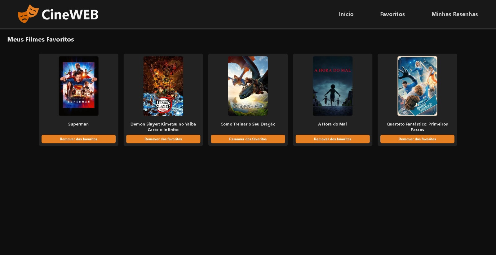

# CineWeb
 ## Este projeto tem como objetivo utilizar os conhecimentos adquiridos na matéria de Desenvolvimento Web I, com html, css e js com api.

## 1. Descrição do Objetivo
A proposta desse trabalho foi desenvolver uma aplicação interativa que consome dados reais da API do TMDB.

Escolhemos esse tema porque o cinema é algo muito popular e quisemos criar uma plataforma onde o usuário pudesse buscar filmes, favoritar e escrever suas próprias resenhas.

---

## 2. Desenvolvimento
- **Ferramentas, Tecnologias e Metodologias:**
    - HTML → Estrutura das páginas.
    - CSS → Estilização responsiva e moderna.
    - JavaScript → Lógica de busca, manipulação de dados e interação com o usuário.
    - LocalStorage → Armazenamento local de favoritos e resenhas.
    - API TheMovieDB → Fonte de dados para filmes (títulos, imagens, notas, etc.).

- **Estrutura e Funcionamento:**
    - index.html → Página inicial, onde o usuário pode buscar filmes e ver recomendações populares.
    - favoritos.html → Lista de filmes que o usuário marcou como favoritos.
    - resenhas.html → Página que exibe todas as resenhas escritas pelo usuário.
    - script.js → Faz as requisições para a API do TheMovieDB, exibe os resultados e controla a adição de favoritos e resenhas.
    - favoritos.js → Gerencia os filmes salvos como favoritos no LocalStorage.
    - resenhas.js → Exibe, organiza e permite remover resenhas salvas.
    - style.css → Estilização com cores escuras, elementos destacados em laranja e design responsivo.

## 3. Conclusão
- **Desafios enfrentados:**
    - Implementar corretamente o uso do LocalStorage para salvar dados entre sessões.
    - Criar modais dinâmicos para permitir a escrita de resenhas sem recarregar a página.
    - Integrar a API do TheMovieDB, lidando com chamadas assíncronas e possíveis erros de rede.
    - Ajustar o layout responsivo para diferentes tamanhos de tela.

- **Trabalhos futuros / Continuação**
    - Criar um sistema de login de usuários, permitindo salvar resenhas na nuvem.
    - Adicionar sistema de curtidas/comentários nas resenhas.
    - Implementar paginação e mais filtros de busca (por gênero, ano, etc.).
    - Criar uma versão mobile-first mais otimizada.
    - Possibilitar que resenhas sejam editadas após criadas.

# 4. Prints com resultados:
## Página Inicial do Site

## Página de Favoritos do Site

## Página de Resenhas do Site

## Área de Resenha
